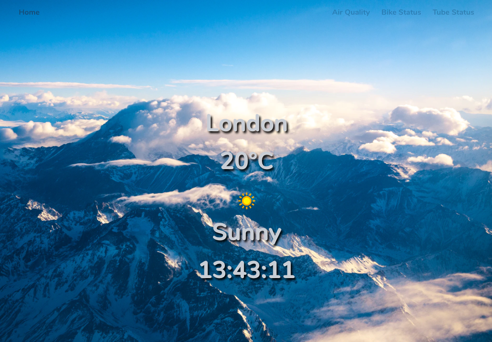
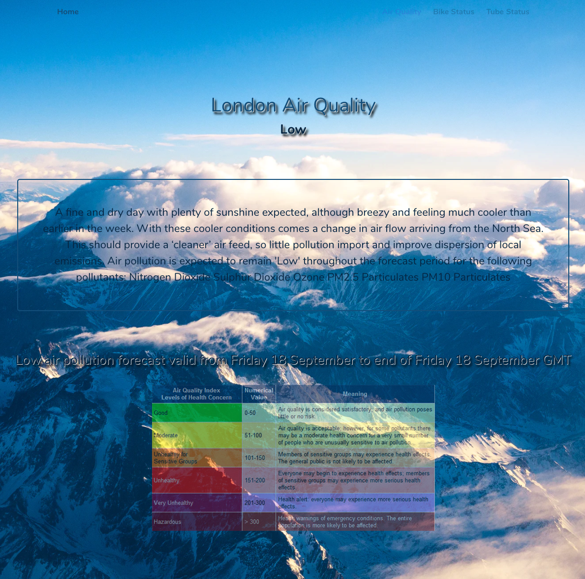
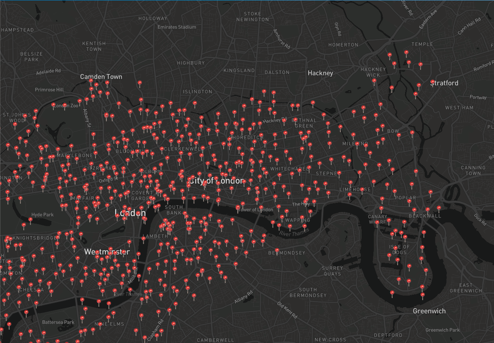

# General Assembly SEI-49 | Project 2 - Weather, Tube, Air Quality App :sun_behind_small_cloud:

## :page_facing_up: Technical brief

- 48 hour hack-a-thon in a paired group.
- **Have several components** - At least one classical and one functional.
- **The app can have a router** - with several "pages", this is up to your disgression and if it makes sense for your project.
- **Must use** a public API
- **Include wireframes** - that you designed before building the app.

---

## :nerd_face: Technologies:

- HTML5
- SCSS/CSS/Bulma
- ReactJS
- JavaScript (ES6)
- Insomnia
- MapBox
- 4 API Implementation

---

## :rocket: Overview

View the site [here](https://weather-bike-tube.netlify.app/)

As we were both conscious of the absolute necessity to reduce the pollution levels in all major cities in the world, we decided to offer uses an **efficient app** returning:

- Current Weather
- Map with all available bike points
- Information related to pollution metrics

We knew we only had **48 hours to complete this project**, so we wanted to make a **simple design yet push some functionalities**.

---

## :old_key: Process

- **We pair coded the whole thing as we wanted to work together entirely and learn from one another.**

- The first thing we did was to create the basic React pages and link them up together. After this we tackled the homepage. As **we wanted to implement a lot of functionalities we were not shown**, we had a lot of **effective Googling** and refactorising. The first functionality was to find out the geolocation of the current user. This would then pull from an external API to show what the current weather is.

 

- We also had to really research how to **implement MapBox**. Something we were not shown before. We **read through the documentation** and after a lot of trial and error, we **rendered a map on a page which pulled from the TfL Bike Points API**. 

 

## :dart: Challenges

- Implementing MapBox without being prior shown.
- Bulma - everything we tried was being overridden and because we were short of time, we tried overriding everything on SASS. 

- Another challenge we faced was an API we wanted to use had **data we couldn't fully render**. We found out that the **description of the Air Quality was HTML code**, and our challenge was to decode that code (lol). We spent our time reading of other people having this issue on **StackOverflow**, and again, after a lot of trial and error we found code that worked and **refactored it to our project**. 

 

---

## :paperclips: Takeaways

- This project was **incredibly fun coding the entire thing as a pair**. We felt by doing this, we were learning the code and more importantly **learning from each other**. **When one person was stuck we always had the other person to help and guide to understand the concept.**

- We believe it was a **good challenge to push ourselves with functionalities and pulling from multiple APIs** to get the information we needed, but this did mean that our CSS was not to our best ability. **We sacrified our CSS in order to have more function**. 

--- 

## :star2: Used Resources

- [TfL API](https://api.tfl.gov.uk/)
- [OpenWeatherAPI](https://openweathermap.org/api)
